# HW1. Нагрузочное тестирование demo-app-1

## 1. Архитектура стенда

Практическая работа выполнялась на стенде `code/demo-app-1`.

Схема пользовательского запроса:

```text
Browser / k6 -> Nginx :8080 -> Backend :8081 -> PostgreSQL :5432
```

Компоненты стенда:

| Компонент         | Роль                                                 |
|-------------------|------------------------------------------------------|
| Nginx             | входная точка, раздача UI и reverse proxy на backend |
| Backend           | Go REST API для пользователей и заказов              |
| PostgreSQL        | основная база данных                                 |
| Prometheus        | сбор метрик                                          |
| Grafana           | визуализация метрик                                  |
| postgres_exporter | метрики PostgreSQL                                   |
| node_exporter     | метрики хоста                                        |
| cAdvisor          | метрики контейнеров                                  |
| k6                | генератор нагрузки                                   |

> : `docker compose ps`, все сервисы стенда в статусе `Up`

>  Prometheus Targets, targets `backend`, `postgres`, `node`, `cadvisor` в статусе `UP`

>   Grafana с подключенным Prometheus datasource и открытым импортированным dashboard

## 2. Метрики

Чтобы понять поведение системы под нагрузкой, я отслеживаю не только факт HTTP-ответа, но и место возможного bottleneck: backend, PostgreSQL, пул соединений, контейнерные ресурсы.

| Зона           | Метрики                                                               | Зачем нужны                                                   |
|----------------|-----------------------------------------------------------------------|---------------------------------------------------------------|
| HTTP-трафик    | `http_requests_total{method,path,status}`                             | RPS, распределение запросов, доля ошибок                      |
| HTTP-latency   | `http_request_duration_seconds{method,path,status}`                   | p95/p99 latency пользовательских запросов                     |
| SQL-latency    | `db_query_duration_seconds{operation,entity}`                         | задержки отдельных операций с `users` и `orders`              |
| SQL-ошибки     | `db_query_errors_total{operation,entity}`                             | поиск отказов на уровне БД                                    |
| Пул БД         | `db_open_connections`, `db_in_use_connections`, `db_wait_count_total` | видно, хватает ли соединений к PostgreSQL                     |
| Бизнес-метрика | `orders_created_total`                                                | система должна не просто отвечать, а успешно создавать заказы |
| PostgreSQL     | connections, query time, locks, transactions                          | проверка гипотезы об упоре в БД                               |
| Контейнеры     | CPU/RAM backend, db, nginx                                            | поиск сервиса, который упирается в ресурсы                    |
| k6             | VUs, RPS, checks, failed requests                                     | сопоставление профиля нагрузки с поведением приложения        |

В приложение были добавлены недостающие метрики SQL-операций, SQL-ошибок, пула соединений и успешного создания заказов. Также HTTP-метрики пишутся по шаблону маршрута, например `/api/orders/{id}`, а не по реальному id в URL. Это снижает кардинальность метрик.

Основная гипотеза перед тестами: при резком росте нагрузки сначала увеличится HTTP latency, затем вырастут задержки SQL-запросов и число занятых соединений к PostgreSQL. Если БД или пул соединений насыщаются, появятся ошибки создания заказов.

## 3. Сценарии нагрузки

Все сценарии запускаются через k6-скрипт `code/demo-app-1/k6/scripts/load-script.js`. Скрипт сам создает тестовых пользователей в `setup()`, поэтому заказы создаются на реальные `user_id`.

### 3.1. Шторм

Цель: проверить резкий скачок нагрузки до 1000 виртуальных пользователей за 10 секунд.

Команда:

```powershell
docker compose run --rm -e SCENARIO=storm k6 run --out experimental-prometheus-rw /scripts/load-script.js
```

Профиль:

| Фаза        | Длительность |        VU |
|-------------|-------------:|----------:|
| Резкий рост |          10s | 0 -> 1000 |
| Удержание   |          30s |      1000 |
| Спад        |          30s | 1000 -> 0 |

> 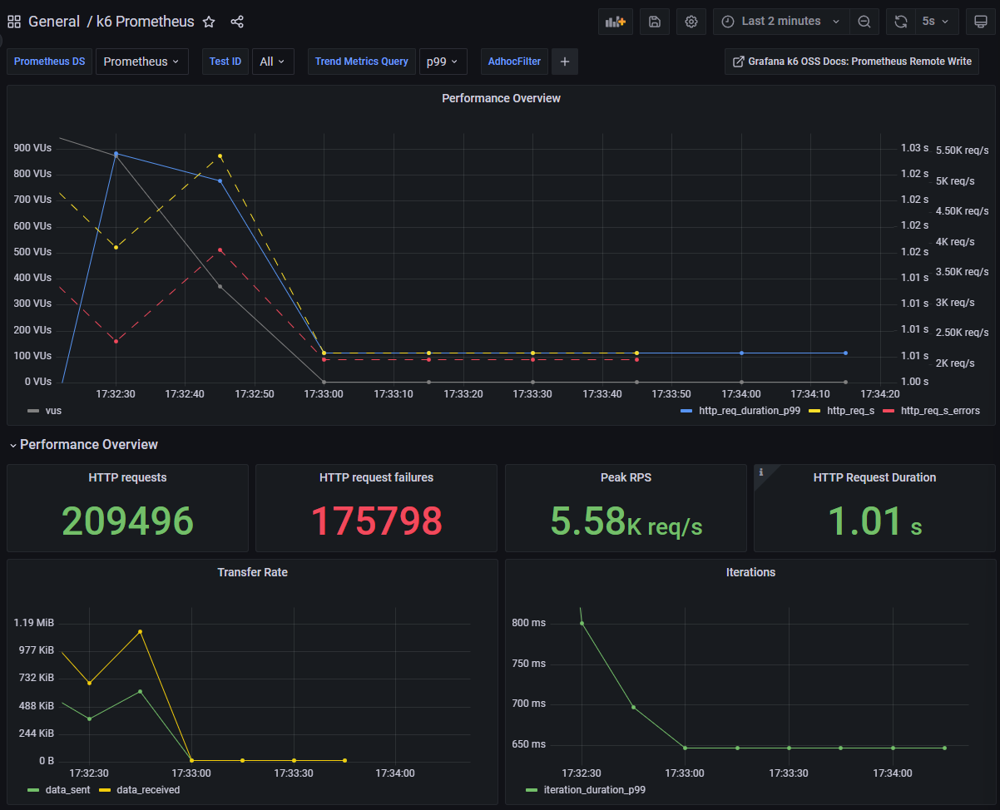 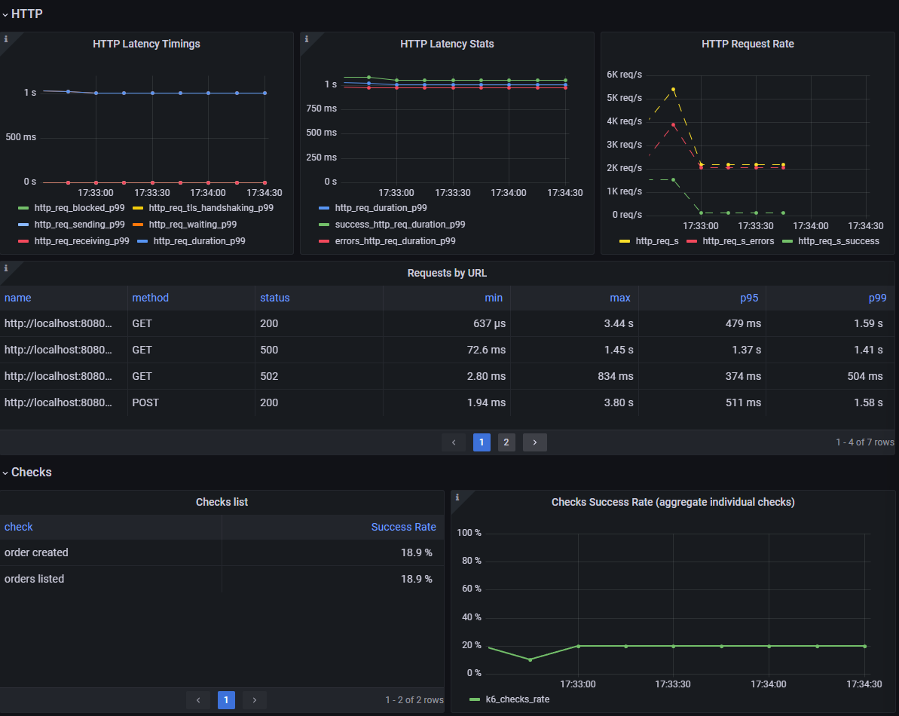 k6 dashboard после сценария `storm`

> 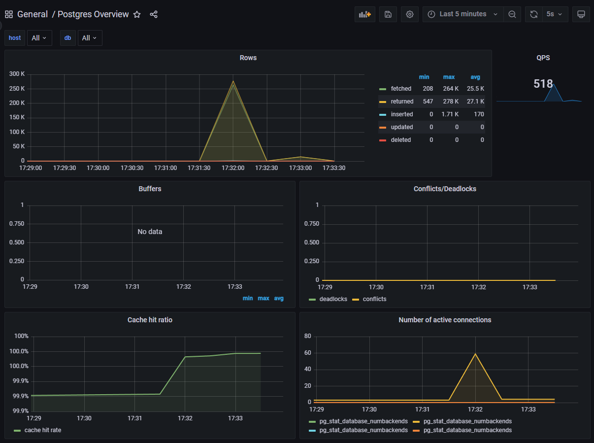 Postgres или backend dashboard после сценария `storm`

Результаты:

| Метрика                  |                                                                        Значение |
|--------------------------|--------------------------------------------------------------------------------:|
| Peak RPS                 |                                             около `5.58k req/s` по k6 dashboard |
| HTTP p95                 | `394.77 ms` по k6; на dashboard по URL p95 успешных запросов около `479-511 ms` |
| HTTP p99                 |                                               около `1.0-1.6 s` по k6 dashboard |
| Failed requests / checks |                                    `83.91%`, `175798` failed из `209494` checks |
| Max DB connections       |                             около `60` active connections по Postgres dashboard |
| Основной bottleneck      |                             PostgreSQL connections и ошибки SQL при резком пике |

Вывод по сценарию:

Сценарий `storm` система не выдержала по уровню ошибок: при росте до `1000` VU k6 выполнил `209496` HTTP-запросов, на dashboard виден пик около `5.58k req/s`, но `83.91%` проверок завершились неуспешно. При этом p95 latency по k6 осталась меньше `1s`, то есть основной симптом не медленные успешные ответы, а массовые отказы. На k6 dashboard видно, что success rate для `order created` и `orders listed` около `18.9%`, а на Postgres dashboard в момент пика растет QPS и число активных соединений примерно до `60`. Основной bottleneck находится в работе с PostgreSQL и обработке высокой конкурентной нагрузки: под резким пиком часть операций создания и чтения заказов начинает падать с HTTP 5xx.

### 3.2. Волна

Цель: проверить плавный рост нагрузки до 500 виртуальных пользователей за 2 минуты.

Команда:

```powershell
docker compose run --rm -e SCENARIO=wave k6 run --out experimental-prometheus-rw /scripts/load-script.js
```

Профиль:

| Фаза         | Длительность |       VU |
|--------------|-------------:|---------:|
| Плавный рост |           2m | 0 -> 500 |
| Удержание    |           1m |      500 |
| Спад         |          30s | 500 -> 0 |

> 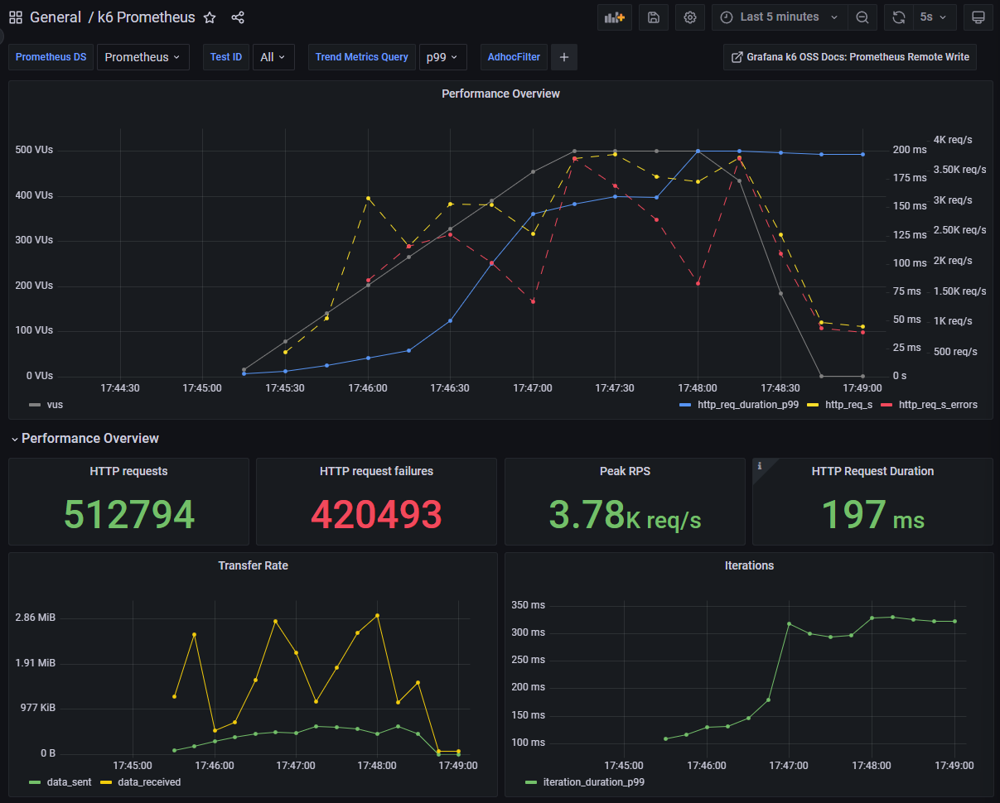 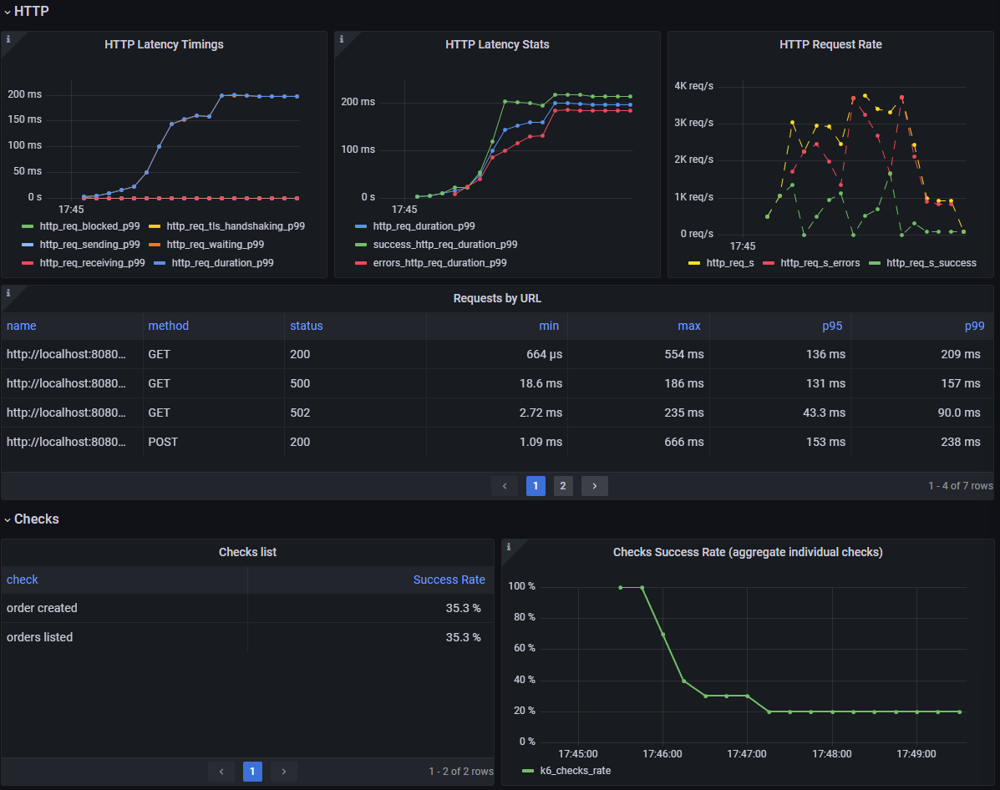 k6 dashboard после сценария `wave`

> 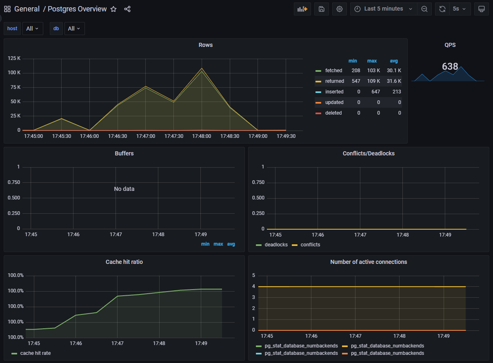 Postgres или backend dashboard после сценария `wave`

Результаты:

| Метрика                               |                                                                                                Значение |
|---------------------------------------|--------------------------------------------------------------------------------------------------------:|
| Peak RPS                              |                                                                                     около `3.78k req/s` |
| HTTP p95                              | около `136-153 ms` для успешных `GET/POST /api/orders`; общий HTTP duration на dashboard около `197 ms` |
| Failed requests / checks              |                          `420493` HTTP failures из `512794` requests; success rate checks около `35.3%` |
| Max DB connections                    |                                                      около `4` active connections по Postgres dashboard |
| Восстановилась ли latency после спада |             да, после снижения VU request rate падает почти до нуля, p99 стабилизируется около `200 ms` |

Вывод по сценарию:

В `wave` нагрузка росла плавно до `500` VU, но система все равно начала массово ошибаться: на dashboard видно `512794` HTTP-запроса и `420493` HTTP failures. В отличие от `storm`, latency не выглядит главным симптомом: p95 для успешных запросов находится примерно в диапазоне `136-153 ms`, а общий HTTP duration на k6 dashboard около `197 ms`. Основная проблема проявляется как рост доли HTTP 5xx при увеличении VU: success rate checks падает примерно до `35.3%`. Postgres dashboard не показывает исчерпания числа активных соединений, поэтому в этом сценарии bottleneck выглядит не как лимит connections, а как отказ API/DB write path под высокой конкурентной нагрузкой.

### 3.3. Модификация: read-heavy

Цель: проверить сценарий, где пользователи чаще просматривают список заказов, чем создают новые заказы.

Команда:

```powershell
docker compose run --rm -e SCENARIO=read_heavy k6 run --out experimental-prometheus-rw /scripts/load-script.js
```

Профиль:

| Фаза      | Длительность |       VU |
|-----------|-------------:|---------:|
| Рост      |          30s | 0 -> 250 |
| Удержание |           1m |      250 |
| Спад      |          30s | 250 -> 0 |

Модификация скрипта: вместо исходного соотношения `80% POST / 20% GET` используется `30% POST / 70% GET`. Так проверяется read-heavy профиль нагрузки, где bottleneck может появиться на запросе списка заказов.

> 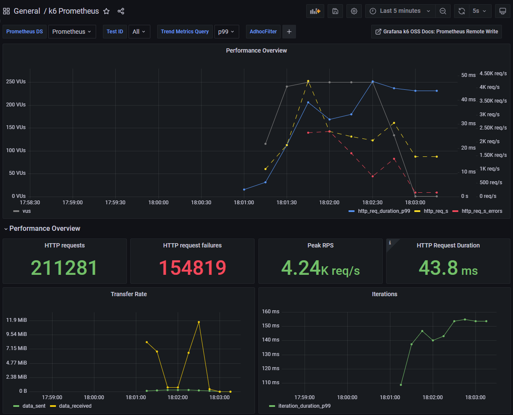 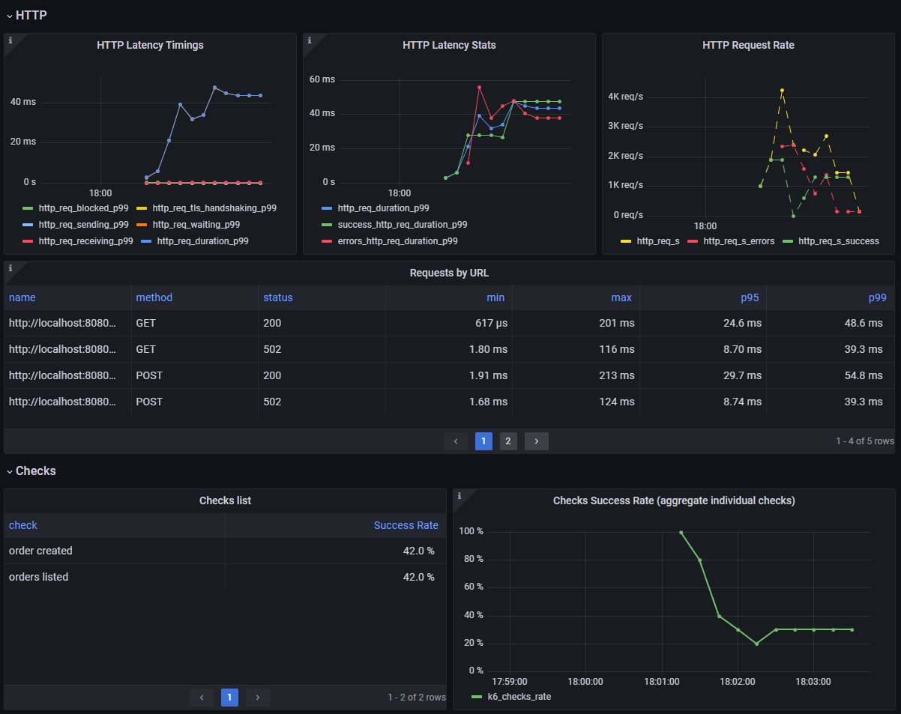 k6 dashboard после сценария `read_heavy`

> 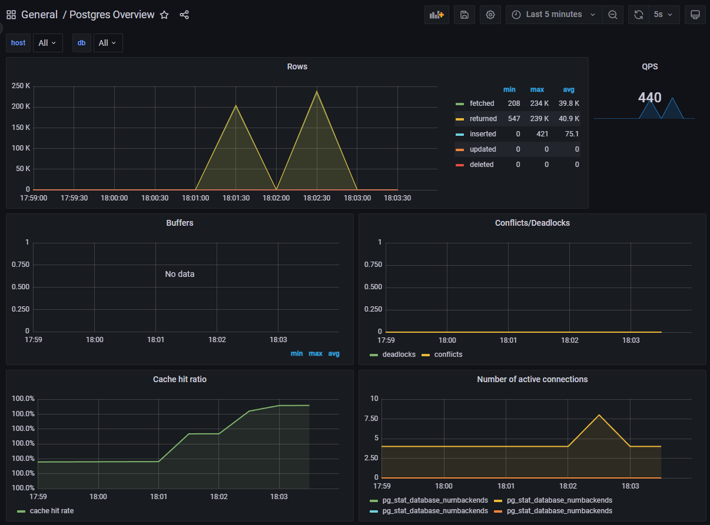 Prometheus или Grafana с HTTP/DB метриками по `GET /api/orders`

Результаты:

| Метрика                     |                                                                                        Значение |
|-----------------------------|------------------------------------------------------------------------------------------------:|
| GET/POST ratio              |       сценарий задан как `70% GET / 30% POST`; среди успешных backend-запросов примерно `70/30` |
| p95 `GET /api/orders`       |                        около `24.6 ms` для успешных `GET`, около `8.70 ms` для `GET` с HTTP 502 |
| p95 DB `select_list/orders` |           около `22 ms` по `db_query_duration_seconds{operation="select_list",entity="orders"}` |
| SQL errors                  |                                           `0` по `db_query_errors_total` за интервал read-heavy |
| Основной bottleneck         | не SQL-запрос чтения, а массовые HTTP 502/отказы на уровне API/proxy под конкурентной нагрузкой |

Вывод по сценарию:

В `read_heavy` нагрузка была смещена в сторону чтения, но сам `GET /api/orders` не стал главным bottleneck: p95 успешного GET около `24.6 ms`, а p95 DB-запроса `select_list/orders` около `22 ms`. При этом k6 dashboard показывает `211281` HTTP-запрос и `154819` HTTP failures, а success rate checks около `42%`. Значит, даже при меньшей доле записей система продолжает массово отдавать HTTP 5xx/502 под конкурентной нагрузкой. Postgres dashboard показывает QPS около `440` и рост active connections примерно до `8`, но SQL errors в backend custom metrics не растут, поэтому проблема выглядит как отказ на уровне API/proxy или исчерпание ресурса обработки запросов, а не как медленный read SQL.

## 4. Общий анализ

Итоговые наблюдения по всем сценариям:

1. В `storm` система не выдержала резкий пик: при росте до `1000` VU было `83.91%` failed checks, а peak RPS на dashboard достиг примерно `5.58k req/s`.
2. В `wave` деградация проявилась не как резкий рост latency, а как высокая доля HTTP failures: `420493` failures из `512794` requests при peak RPS около `3.78k req/s`.
3. В `read_heavy` нагрузка сместилась на чтение, но `GET /api/orders` и SQL `select_list/orders` остались быстрыми: p95 около `24.6 ms` на HTTP и около `22 ms` на DB. Основной симптом снова HTTP 5xx/502.
4. По всем сценариям главный риск - не средняя latency успешных запросов, а массовые отказы при высокой конкурентной нагрузке. Поэтому сначала нужно ограничивать конкуренцию, настраивать backpressure/rate limit и разбираться, почему часть запросов не доходит до успешной обработки backend/DB.
5. После снятия нагрузки request rate и latency возвращаются к нормальному уровню, то есть проблема проявляется именно во время пика, а не как постоянная деградация после теста.

## 5. Предложения по улучшению

| Найденная проблема                                | Возможное решение                                                                    |
|---------------------------------------------------|--------------------------------------------------------------------------------------|
| PostgreSQL упирается в connections или query time | Настроить пул соединений, добавить PgBouncer, оптимизировать SQL, добавить индексы   |
| Backend упирается в CPU                           | Запустить несколько backend-инстансов и балансировать трафик через LB-вариант стенда |
| Высокая latency на `GET /api/orders`              | Добавить пагинацию, индекс под сортировку, кэширование read-heavy endpoint           |
| Ошибки при резком пике                            | Добавить rate limit, backpressure, очередь для записи заказов                        |
| Недостаточно наблюдаемости                        | Добавить алерты по p95, 5xx, DB wait count и failed order creation                   |
| Nginx становится bottleneck                       | Настроить worker connections или вынести балансировщик отдельно                      |

## 6. Контрольный прогон после исправлений

После первых прогонов были внесены изменения:

- включен LB-стенд `docker-compose-lb.yaml`: HAProxy балансирует трафик на 3 backend-инстанса;
- для каждого backend ограничен пул соединений к PostgreSQL: `DB_MAX_OPEN_CONNS=50`, `DB_MAX_IDLE_CONNS=25`;
- добавлен `/health` endpoint и HTTP health check в HAProxy;
- добавлена пагинация для списков `/api/users` и `/api/orders`: `limit` по умолчанию `50`, максимум `100`, `offset` не меньше `0`;
- добавлены индексы `idx_orders_created_at_id_desc` и `idx_orders_user_id`;
- для LB-стенда добавлен отдельный Prometheus-конфиг, который собирает метрики со всех трех backend.

Стенд после исправлений запускался так:

```powershell
docker compose down
docker compose -f docker-compose-lb.yaml up -d --build
```

Индексы были применены к существующей БД:

```powershell
docker compose -f docker-compose-lb.yaml exec -T db psql -U demo -d demo -c "CREATE INDEX IF NOT EXISTS idx_orders_created_at_id_desc ON orders (created_at DESC, id DESC); CREATE INDEX IF NOT EXISTS idx_orders_user_id ON orders (user_id);"
```

>  `docker compose -f docker-compose-lb.yaml ps`, где видны `backend`, `backend-2`, `backend-3`, `haproxy`, `postgres`, `prometheus`, `grafana`

>  Prometheus Targets после исправлений, где `backend:8081`, `backend-2:8081`, `backend-3:8081` в состоянии `UP`

Контрольные прогоны:

```powershell
docker compose -f docker-compose-lb.yaml run --rm -e SCENARIO=storm k6 run --out experimental-prometheus-rw /scripts/load-script.js
docker compose -f docker-compose-lb.yaml run --rm -e SCENARIO=wave k6 run --out experimental-prometheus-rw /scripts/load-script.js
docker compose -f docker-compose-lb.yaml run --rm -e SCENARIO=read_heavy k6 run --out experimental-prometheus-rw /scripts/load-script.js
```

> 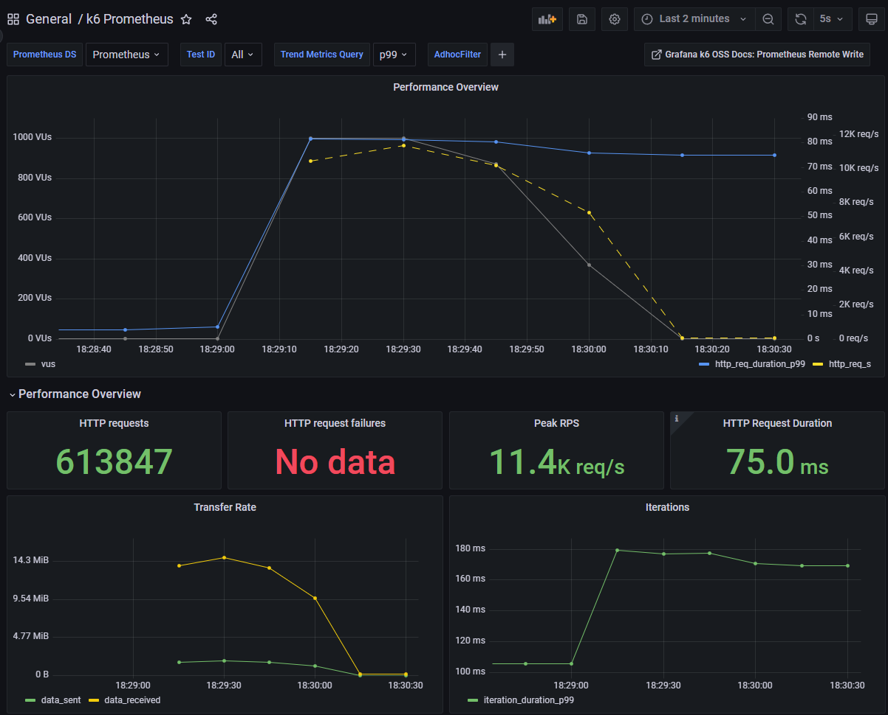 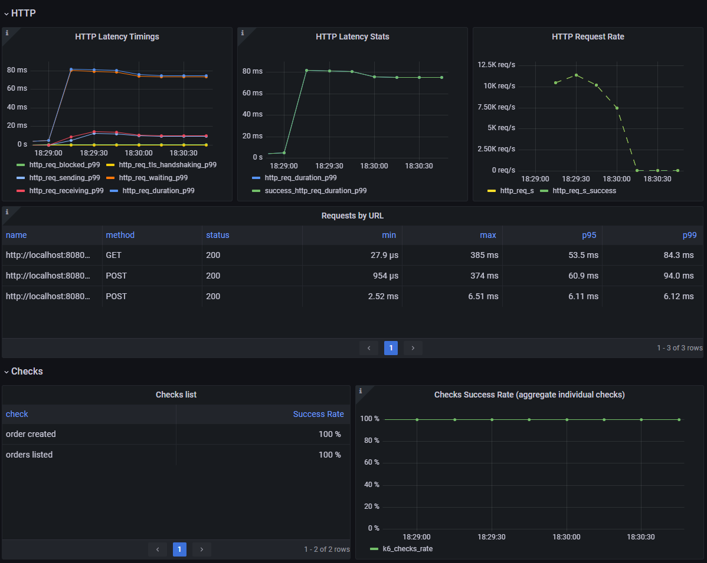 k6 dashboard после `storm` на LB-стенде

> 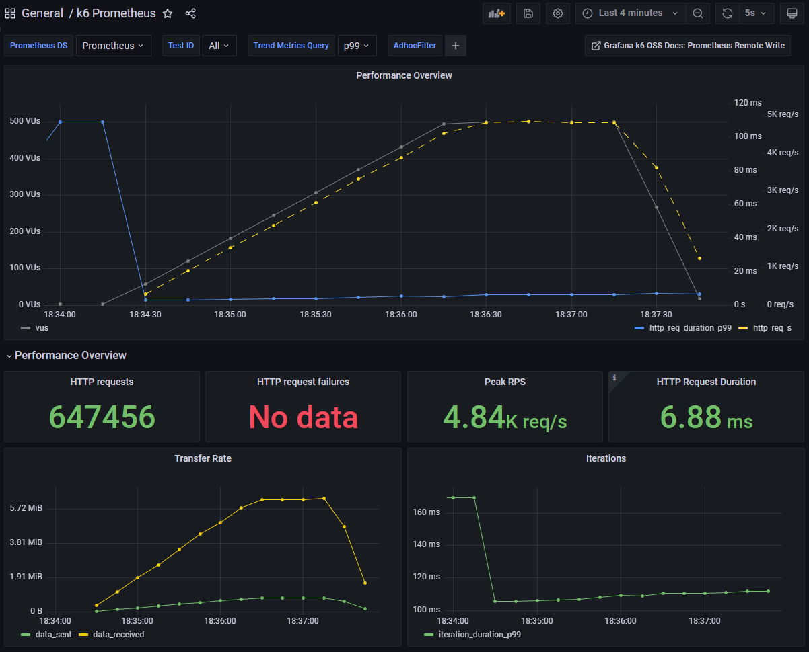 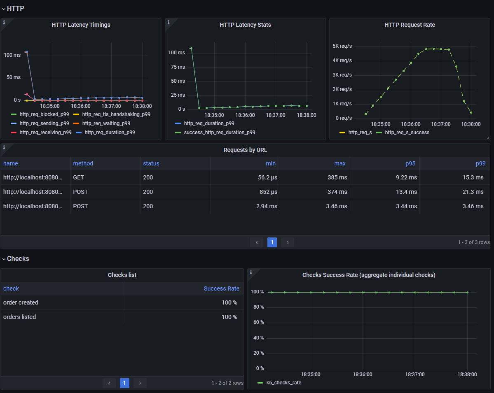 k6 dashboard после `wave` на LB-стенде

> 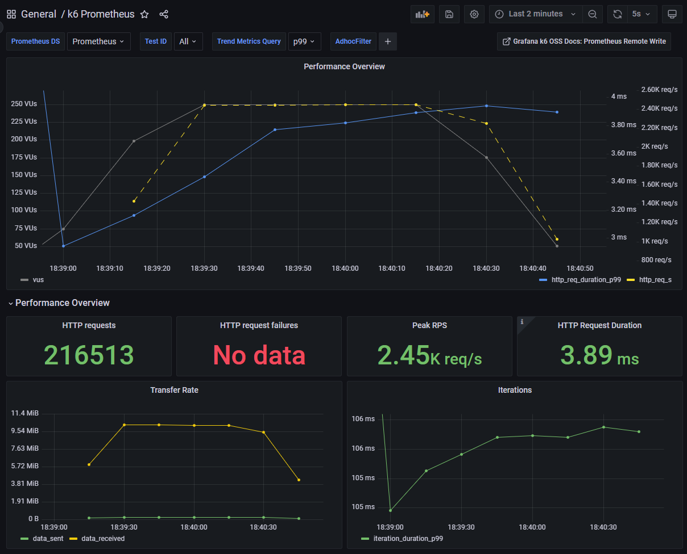 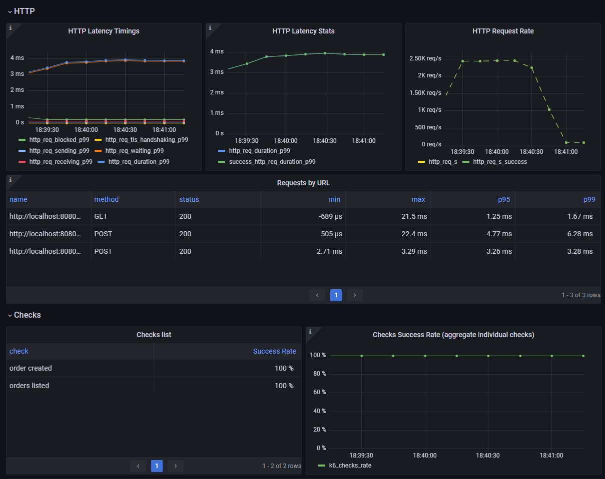 k6 dashboard после `read_heavy` на LB-стенде

> 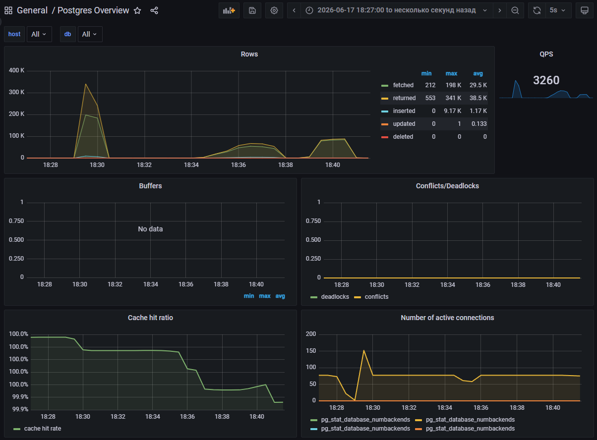 Postgres dashboard после контрольных прогонов

Итог после исправлений:

- `storm`: `613847` HTTP requests, HTTP failures отсутствуют, peak RPS около `11.4k req/s`, HTTP request duration около `75 ms`, checks success `100%`;
- `wave`: `647456` HTTP requests, HTTP failures отсутствуют, peak RPS около `4.84k req/s`, HTTP request duration около `6.88 ms`, checks success `100%`;
- `read_heavy`: `216513` HTTP requests, HTTP failures отсутствуют, peak RPS около `2.45k req/s`, HTTP request duration около `3.89 ms`, checks success `100%`;
- Prometheus показал все 3 backend в `UP`, на Postgres dashboard QPS доходил примерно до `3260`, число активных соединений доходило до `150`, conflicts/deadlocks не появились.

Главный эффект исправлений: система перестала массово отдавать HTTP 5xx/502 на тех же сценариях. Самыми важными изменениями оказались горизонтальное масштабирование backend, ограничение пула соединений к PostgreSQL и более аккуратный read path с пагинацией и индексом под сортировку заказов.
