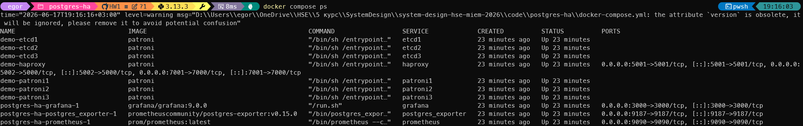
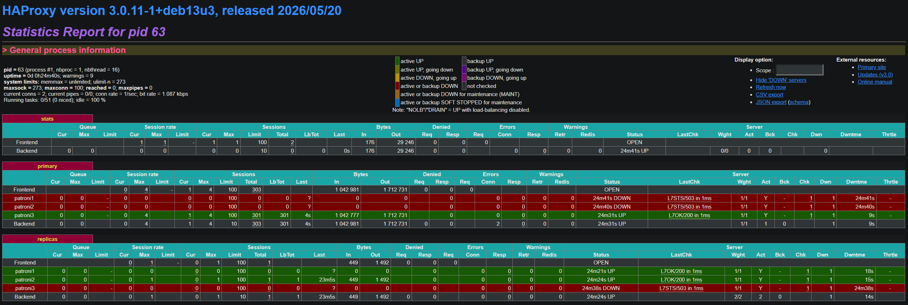
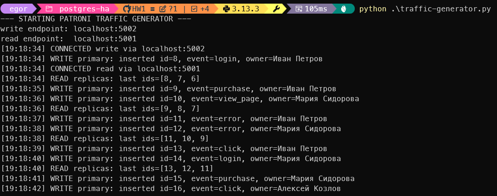
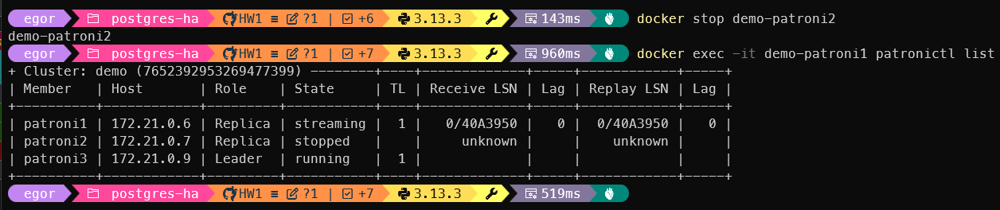
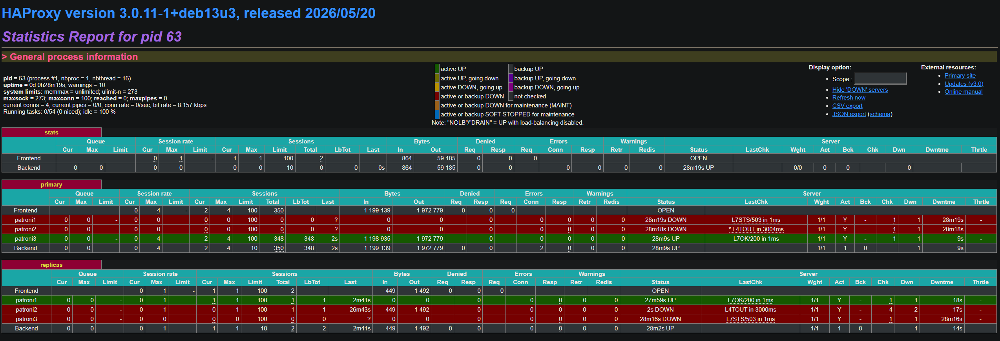
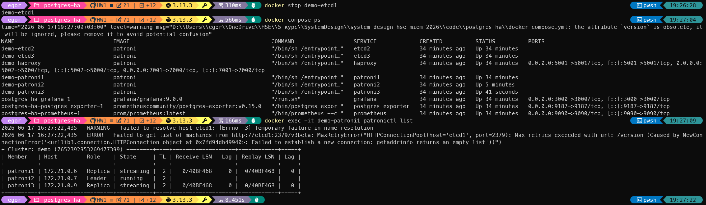
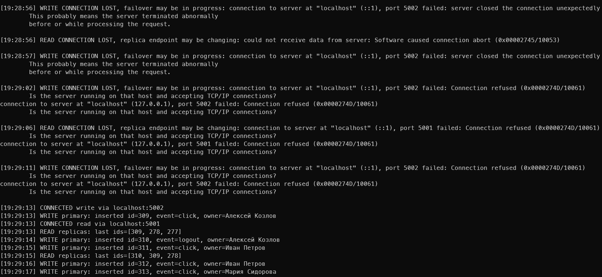
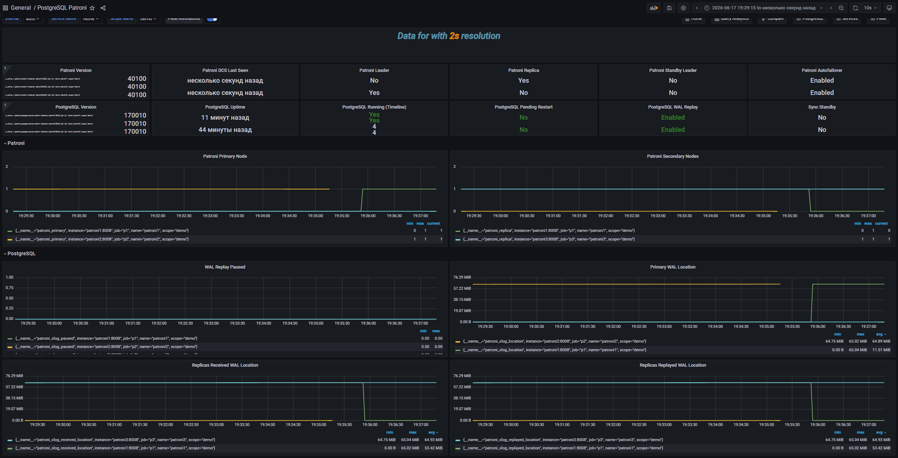

# HW2 Practice. Patroni PostgreSQL High Availability Cluster

## 1. Запуск стенда

Практическая часть выполнялась на стенде `code/postgres-ha`.

Сначала был собран Docker-образ Patroni:

```powershell
cd "D:\Users\egor\OneDrive\HSE\5 курс\SystemDesign\system-design-hse-miem-2026\code\postgres-ha\patroni-master"
docker build -t patroni .
```

Затем был запущен compose-стенд:

```powershell
cd ..
docker compose up -d
docker compose ps
```

> 
> Скриншот 1. Запущенные контейнеры стенда: `patroni1`, `patroni2`, `patroni3`, `etcd1`, `etcd2`, `etcd3`, `haproxy`, `prometheus`, `grafana`, `postgres_exporter`.

Стенд состоит из трех PostgreSQL-нод под управлением Patroni, трех etcd-нод, HAProxy, Prometheus, Grafana и PostgreSQL exporter. etcd хранит состояние кластера и лидерский ключ, Patroni управляет ролями PostgreSQL-нод, а HAProxy дает клиентам единые endpoints для записи и чтения.

## 2. Состояние Patroni-кластера

Состояние кластера проверялось через `patronictl`:

```powershell
docker exec -it demo-patroni1 patronictl list
```

> 
> Скриншот 2. Вывод `patronictl list`.

В кластере есть одна нода с ролью `Leader` и две ноды с ролью `Replica`. Лидер принимает запись, реплики получают изменения с primary через репликацию. Если лидер становится недоступен, Patroni выбирает нового лидера из доступных реплик при сохраненном quorum etcd.

## 3. HAProxy

Страница HAProxy stats открывалась по адресу:

```text
http://localhost:7001/
```

> 
> Скриншот 3. HAProxy stats.

HAProxy скрывает от клиента текущую топологию PostgreSQL. В этом стенде наружу проброшены два PostgreSQL endpoint:

- `localhost:5002` - запись в primary через HAProxy;
- `localhost:5001` - чтение с replicas через HAProxy.

HAProxy определяет роли нод через HTTP health checks Patroni: endpoint `/primary` успешен только на лидере, а `/replica` успешен на репликах.

## 4. Создание таблиц и стартовых данных

SQL-скрипт из задания был применен к primary endpoint:

```powershell
Get-Content .\init-events.sql | docker exec -i -e PGPASSWORD=postgres demo-patroni1 psql -h haproxy -p 5000 -U postgres -d postgres
```

Проверка количества записей:

```powershell
docker exec -it -e PGPASSWORD=postgres demo-patroni1 psql -h haproxy -p 5000 -U postgres -d postgres -c "select count(*) as owners_count from owners; select count(*) as events_count from events;"
```

> 
> Скриншот 4. Успешное выполнение SQL-скрипта или проверка количества записей в `owners` и `events`.

В базе созданы таблицы `owners` и `events`, внешняя связь от `events.owner_name` к `owners.owner_name`, индексы по времени события и владельцу, а также стартовые записи.

## 5. Генератор трафика

Зависимость для генератора:

```powershell
pip install psycopg2-binary
```

Запуск генератора:

```powershell
python .\traffic-generator.py
```

> 
> Скриншот 5. Работающий `traffic-generator.py`: успешные записи через primary endpoint и чтения через replica endpoint.

Проверка новых записей:

```powershell
docker exec -it -e PGPASSWORD=postgres demo-patroni1 psql -h haproxy -p 5000 -U postgres -d postgres -c "select id, event_name, owner_name, timestamp from events order by id desc limit 10;"
```

> 
> Скриншот 6. Новые записи в таблице `events`.

Генератор пишет в primary через `localhost:5002` и читает через replica endpoint `localhost:5001`. При штатной работе в stdout видны успешные операции `WRITE primary` и `READ replicas`.

## 6. Проверка отказоустойчивости

Во время экспериментов генератор трафика оставался запущенным в отдельном терминале.

### 6.1. Остановка реплики

Текущие роли проверялись командой:

```powershell
docker exec -it demo-patroni1 patronictl list
```

Одна из replica-нод была остановлена:

```powershell
docker stop demo-patroni2
docker exec -it demo-patroni1 patronictl list
```

> 
> Скриншот 7. `patronictl list` после остановки реплики.

> 
> Скриншот 8. HAProxy stats после остановки реплики.

После остановки одной реплики primary остается доступной, запись продолжает работать. Чтение через replica endpoint может временно переподключиться, но кластер сохраняет работоспособность, так как лидер и quorum etcd остаются доступными.

Нода была возвращена командой:

```powershell
docker start demo-patroni2
```

### 6.2. Остановка лидера

Текущий лидер был найден через:

```powershell
docker exec -it demo-patroni1 patronictl list
```

Затем контейнер лидера был остановлен:

```powershell
docker stop demo-patroni3
```

Через несколько секунд состояние проверялось с живой Patroni-ноды:

```powershell
docker exec -it demo-patroni2 patronictl list
```

> 
> Скриншот 9. Генератор трафика во время failover: временная потеря соединения и восстановление записи.

> 
> Скриншот 10. `patronictl list` после failover, где виден новый лидер.

> 
> Скриншот 11. HAProxy stats после переключения лидера.

После остановки лидера Patroni выбирает нового primary из реплик, а HAProxy переключает write endpoint на новую primary-ноду. Для клиента это проявляется как короткий разрыв соединения, после которого запись восстанавливается.

Остановленная нода была возвращена командой:

```powershell
docker start demo-patroni3
```

### 6.3. Остановка одной etcd-ноды

```powershell
docker stop demo-etcd1
docker compose ps
docker exec -it demo-patroni1 patronictl list
```

> 
> Скриншот 12. Состояние кластера после остановки одной etcd-ноды.

При остановке одной etcd-ноды quorum сохраняется: из трех etcd-нод остаются две. Patroni продолжает видеть DCS, поэтому кластер остается управляемым, чтение и запись продолжаются.

Нода была возвращена командой:

```powershell
docker start demo-etcd1
```

### 6.4. Потеря quorum etcd

```powershell
docker stop demo-etcd1 demo-etcd2
docker compose ps
docker exec -it demo-patroni1 patronictl list
```

> 
> Скриншот 13. Состояние после остановки двух etcd-нод.

При остановке двух etcd-нод quorum теряется. В таком состоянии Patroni не может надежно выполнять выборы нового лидера. Это критичный отказ control plane: текущие подключения могут некоторое время жить, но автоматический failover без DCS quorum невозможен.

etcd-ноды были возвращены командой:

```powershell
docker start demo-etcd1 demo-etcd2
```

### 6.5. Остановка HAProxy

```powershell
docker stop demo-haproxy
```

> 
> Скриншот 14. Ошибки генератора при остановленном HAProxy.

PostgreSQL-ноды и Patroni продолжают работать, но клиент теряет единые endpoints `localhost:5002` и `localhost:5001`. В текущем стенде HAProxy является единой точкой отказа для клиентского доступа. В production такой слой нужно дублировать: например, использовать два HAProxy-инстанса с Keepalived/VRRP, managed load balancer или Kubernetes Service.

HAProxy был возвращен командой:

```powershell
docker start demo-haproxy
```

## 7. Grafana и Prometheus

Prometheus доступен по адресу:

```text
http://localhost:9090
```

Grafana доступна по адресу:

```text
http://localhost:3000
```

Логин и пароль Grafana:

```text
admin / admin
```

Готовые JSON-дашборды были импортированы из директории:

```text
code/postgres-ha/grafana_dashboards
```

> 
> Скриншот 15. Grafana dashboard во время штатной работы генератора.

> 
> Скриншот 16. Grafana или Prometheus во время failover лидера.

На дашбордах видны состояние PostgreSQL/Patroni, активные соединения, операции с таблицами и изменение роли нод во время failover.

## 8. Итог

| Эксперимент               | Результат                                                                               | Вывод                                              |
|---------------------------|-----------------------------------------------------------------------------------------|----------------------------------------------------|
| Остановка реплики         | Запись продолжила работать, replica endpoint переподключился к доступным репликам       | Одна реплика не является SPOF                      |
| Остановка лидера          | После короткого разрыва Patroni выбрал нового лидера, HAProxy переключил write endpoint | Primary отказоустойчив при сохраненном quorum etcd |
| Остановка одной etcd-ноды | Кластер продолжил работать                                                              | Quorum 2 из 3 сохраняется                          |
| Остановка двух etcd-нод   | Quorum потерян, автоматический failover становится невозможен                           | etcd-кластер критичен для управления Patroni       |
| Остановка HAProxy         | Клиенты потеряли доступ к write/read endpoints                                          | HAProxy в текущем стенде является SPOF             |

Patroni + etcd + HAProxy решают отказ primary-ноды PostgreSQL: при падении лидера Patroni выбирает новую primary-ноду, а HAProxy переводит клиентские подключения на нее. При этом отказоустойчивость всей системы зависит не только от PostgreSQL. etcd должен сохранять quorum, а HAProxy в production должен быть задублирован, иначе клиентский доступ остается с единой точкой отказа.
